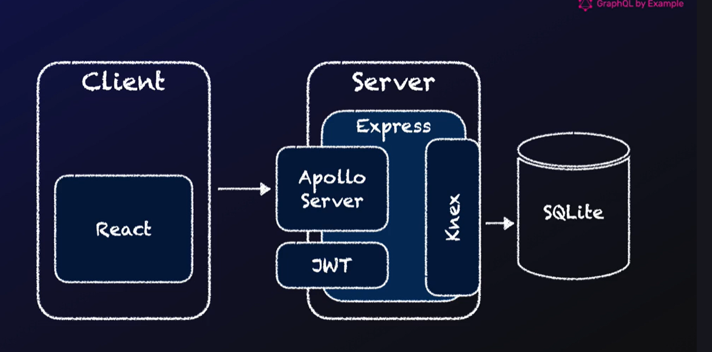

# GraphQL Complete Guide

## Basic Summary

### Client

- Dependencies for GraphQL: `@apollo/client`, `graphql`, `graphql-request`
- In `app.tsx`, wrap your entire app components with `<ApolloProvider client={apolloClient}> ... </ApolloProvider>`
- The `apolloClient` will be created in a `queries-mutations.js` file, where you'll store all your links, fragments, queries, and mutations
- Here's how to create a GraphQL apolloClient with appropriate server and auth links:

```javascript
const httpLink = createHttpLink({ uri: "http://localhost:9000/graphql" });
const authLink = new ApolloLink((operation, forward) => {
    const accessToken = getAccessToken();
    if (accessToken) {
        operation.setContext({
            headers: { Authorization: `Bearer ${accessToken}` },
        });
    }
    return forward(operation);
});
export const apolloClient = new ApolloClient({
    link: concat(authLink, httpLink),
    cache: new InMemoryCache(),
});
```

- On each page, you'll either read data (query) or write data (mutations). Create hooks for this by first understanding which queries and mutations the backend exposes.

### Server

There are 3 main files: `server.js`, `schema.graphql`, and `resolvers.js`.

- `server.js` is where you create your Apollo server, which needs `typeDefs` (schema) and `resolvers`
- Here's how to create and start your server:

```javascript
const typeDefs = await readFile("./schema.graphql", "utf-8");

const apolloServer = new ApolloServer({
    typeDefs,
    resolvers,
});
await apolloServer.start();
```

If you have an Express app, you can add a middleware for the GraphQL route to pass context:

```javascript
app.use(
    "/graphql",
    apolloExpressMiddleware(apolloServer, { context: getContext }),
); // middleware for "/graphql" requests

async function getContext({ req }) {
    if (req.auth) {
        let user = await getUser(req.auth.sub);
        return { user };
    }
    return {};
}
```

#### TypeDefs

There are 2 basic types:

- **Query** - Exposes what can be requested/queried (read data)
- **Mutation** - Exposes what can be used to create, update, or delete data

All types used for these are declared in the same file:

```graphql
type Query {
    jobs: [Job!]
    job(id: ID!): Job
    company(id: ID!): Company
}

type Mutation {
    createJobMutation(input: CreateJobInput!): Job
    deleteJobMutation(id: ID!): Job
    updateJobMutation(input: UpdateJobInput!): Job
}

type Job {
    id: ID!
    title: String
    description: String
    """
    Example documentation comment for date.
    """
    date: String
    company: Company
}
```

#### Resolvers

Resolvers tell how responses should be returned for all typeDefs. You need resolvers for all queries and mutations, but for other types, only create resolvers for fields that can't be directly fetched from the database.

Example of all 3 kinds of resolvers:

```javascript
Query: {
    // When job is queried, this function executes and returns the response
    job: async (parent, args) => {
        // args contains the arguments passed to the query (in this case, the id argument)
        const job = await getJob(args.id);
        if (!job) return customNotFoundError("Job Not Found", args.id);
        return job;
    },
},

Job: {
    // This overrides the response for the date field
    date: (parent) => parent.createdAt.slice(0, "yyyy-mm-dd".length),
    // Fetches company details using the companyId from the parent job object
    company: (parent) => getCompany(parent.companyId),
},

Company: {
    // Fetches jobs for this company using the company's id
    jobs: (parent) => getJobsByCompanyId(parent.id),
},

Mutation: {
    // parent: root
    // args: user arguments object
    // context: headers, tokens, etc.
    createJobMutation: (
        parent,
        { input: { title, description } },
        { user },
    ) => {
        if (!user) {
            throw unauthorizedError("Missing authentication");
        }
        return createJob({ title, description, companyId: user.companyId });
    },
}
```

## Introduction

Visit [graphql.org](http://graphql.org) for complete documentation.

GraphQL helps fix:

- **Under-fetching** - Getting too little data in one request
- **Over-fetching** - Getting too much data in one request

It provides **precise fetching** - Get exactly what you need.

- There's a single `/graphql` route where you POST requests
- GraphQL helped Facebook optimize API latency on mobile devices

## Fundamentals

- **Type Definitions (TypeDef)** - Define GraphQL schemas with things that can be requested by the client
- **Resolvers** - Tell what needs to be done when the client queries anything from typeDef, based on the queried type
- Setup: `npm i graphql @apollo/server`
- Create an instance of `ApolloServer`, pass it to `startStandaloneServer()`, and await the promise
- A GET request on the server displays a sandbox (browser interface) to test operations
- You can use a code-first approach where resolvers are written as JavaScript code without SDL

### Schema



### Workflow

1. Add your query or mutation in schema
2. Create a resolver for your query or mutation
3. Create a database utility function to call in your resolver
4. Go to sandbox and create a valid request
5. Go to frontend, create a client call for that resolver in your `queries-mutations.js` file
6. Call the frontend utility function where needed
